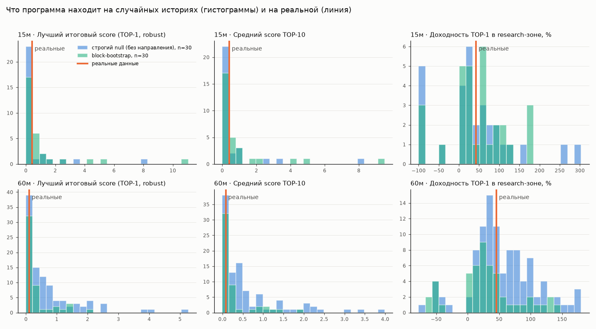

# Логический аудит BYBIT SUPERTREND LAB v0.8.0 (до этапа 2)

Код программы не менялся. Все проверочные скрипты лежат в `audit/`, данные — вне репозитория.

**Данные.** Bybit API из среды проверки заблокирован по географии. Поэтому использован публичный архив Binance по бессрочному фьючерсу BTCUSDT: 01.03.2025–31.08.2026, таймфреймы 5м/15м/30м/60м, плюс реальная история funding. Пропусков и дублей в данных нет. Это близкий заменитель Bybit BTCUSDT. Если прислать свои `data\BTCUSDT_*.csv`, те же скрипты пересчитают всё на ваших свечах.

**Настройки как у вас:**
- режим «Глубокий»;
- история 18 месяцев;
- комиссия 0,055 % и проскальзывание 0,02 % на сторону.

## 0. Главный вывод

| Вопрос | Ответ |
|---|---|
| **А. Можно ли доверять сравнению параметров между собой?** | **Пока нет.** Арифметика верна: программа правильно описывает, как вариант торговал в прошлом. Но более высокий score не предсказывает лучший результат в следующем периоде. На 60м ранговая корреляция SELECTION→VALIDATION равна −0,01. На 15м/5м она положительна (+0,27/+0,31), но объясняется общим падением рынка в обоих периодах, а не устойчивым преимуществом параметров: относительно holdout корреляция становится отрицательной (−0,20/−0,56). TOP-100 в holdout не лучше среднего варианта. Null-тесты: реальный TOP **статистически не отличается** от того, что программа находит на историях без какого-либо преимущества (p = 0,29–0,72). |
| **Б. Можно ли доверять абсолютным PnL, просадке и ожиданиям реальной торговли?** | **Нет.** Это результат отбора лучшего из десятков тысяч вариантов на тех же данных. Просадка занижена на 20–40 % (по закрытым сделкам). Funding не учтён. Окна обнуляют позицию. Последний участок истории уже просматривался. Лучший результат на реальной истории примерно равен простому «шорт и держать» (+45,7 % против +44,4 %), а в holdout TOP-100 в среднем −12,9 %. |

Числа подтверждают, что арифметика бэктеста, Supertrend и защита от подглядывания исправны. Проблема — в том, **что** программа оптимизирует и **как** выбирает победителей (разделы 6, 9, 12).

## 1. Что оптимизирует программа

1. Для каждой конфигурации считаются бэктесты на трёх участках: SELECTION, VALIDATION и holdout. Плюс отдельный бэктест каждого 21-дневного окна.
2. **SELECTION score** (формула в разделе 6) направляет поиск: устойчивые области, fine-, cluster- и deep-этапы, выбор компонентов Adaptive V2.
3. **Итоговый score `robust`** объединяет SELECTION и VALIDATION: геометрическое среднее, умноженное на штрафы за разницу медиан, за долю положительных окон и за дисбаланс фаз.
4. **TOP-100** — диверсифицированная выборка по `robust`: сначала по 2 представителя каждой «семьи» (тип стратегии, ТФ, режим), затем лучшие по `robust`, без почти одинаковых соседей.
5. Holdout в ранжировании не участвует. Это подтверждено тестом (раздел 4).

«Лучший» вариант — это максимум отношения доходность/просадка по закрытым сделкам в обеих фазах, с поправками на число сделок, долю положительных окон, худшее окно и медиану окна. **Сравнения с рынком (benchmark) нет:** заработать на общем падении рынка считается так же хорошо, как заработать на умении входить и выходить.

## 2. Логика бэктеста

Правила программы:
- сигнал — направление Supertrend на **закрытой** свече i;
- сделка исполняется по **open** свечи i+1;
- проскальзывание — фиксированный % от цены;
- доход сделки = gross − 2×комиссия;
- капитал реинвестируется целиком (1x), сделки начисляются последовательно (компаундинг).

Ручная проверка (`audit/check_pnl_manual.py`): 27 проверок на свечах с круглыми ценами, ожидаемые числа посчитаны отдельно от кода программы — **все совпали**.

| Пункт | Статус | Пояснение / доказательство |
|---|---|---|
| Вход | CORRECT | Сигнал на close[i] → open[i+1] (S1, S2) |
| Выход | CORRECT | Смена сигнала на close[j] → open[j+1]; в конце участка — close последней свечи (S6) |
| Стоп-лосс / тейк-профит | NOT APPLICABLE | В стратегии их нет: позиция держится, пока не сменится сигнал |
| Порядок событий внутри свечи, несколько уровней на одной свече | NOT APPLICABLE для исполнения; STAGE 2 для просадки и ликвидации | Исполнение только по open. Внутрисвечные high/low нужны лишь для честной просадки (S7) |
| Смена направления (BOTH) | CORRECT | Выход и обратный вход на одном open; комиссия за каждую сторону (S3) |
| Перенос позиции между свечами | CORRECT внутри участка | Позиция держится до смены сигнала (S5) |
| Позиция на границе 21-дневного окна | **BUG (методологический) → STAGE 2** | Каждое окно начинается без позиции: принудительный выход на close и повторный вход на open второй свечи следующего окна (S6). Сделка +4,80 % превращается в цепочку +2,52 %. На реальном TOP-20 сумма доходностей окон — 17 % против 35 % при непрерывной позиции (медианы). Искажены статистики окон, которые входят в score |
| Границы SELECTION / VALIDATION / holdout | QUESTIONABLE | Те же принудительные закрытия, и каждый участок стартует без позиции |
| Расчёт PnL long / short | CORRECT | Линейный USDT-контракт: (выход−вход)/вход, для шорта наоборот (S1–S5) |
| Количество сделок | CORRECT | Принудительное закрытие в конце участка считается сделкой |
| Winrate | CORRECT (соглашение) | Сделка с нулевым доходом считается убыточной |
| Profit factor | CORRECT (соглашение) | Сумма простых доходностей; без убытков PF=99, в score ограничен 3 |
| Просадка | **BUG для ранжирования → STAGE 2** | Только по закрытым сделкам. Пример S7: в программе 0 %, реально 32 %. На реальном TOP-20 реальная просадка в 1,23 раза больше (+3,2 п.п., медиана) |
| Комиссии | QUESTIONABLE (мелко) | Обе комиссии берутся от суммы входа; точнее — выход от суммы выхода. Ошибка ≈ fee×|gross| ≈ 0,02 % на сделку (S8) |
| Funding | STAGE 2 | Не учитывается. На реальных данных TOP-20 (почти все шорты) **получил бы** +1,2…1,6 % капитала, лонги бы платили. Знак зависит от стороны и периода |
| Проскальзывание | QUESTIONABLE | Фиксированные 0,02 %, без зависимости от волатильности (S4) |
| Шорт с убытком >100 % | CORRECT для 1x | Ограничен −99,9999 % (S9); ликвидации при 1x нет |
| Месяцы | CORRECT | Сделка относится к месяцу выхода |
| Adaptive V2 | CORRECT | Ядро Numba = векторный бэктест = ручной расчёт (S10) |

## 3. Supertrend и TradingView

`audit/check_supertrend_spec.py` сравнивает программу с дословным переносом опубликованного Pine-кода `ta.supertrend` (это не выгрузка из самого TradingView).

| Элемент | Программа | TradingView `ta.supertrend` | Совпадает? |
|---|---|---|---|
| Источник | hl2 = (high+low)/2 | hl2 | да |
| ATR | Wilder (RMA): первое значение = SMA первых N TR, далее (prev×(N−1)+TR)/N | `ta.rma(ta.tr(true), N)`: SMA, далее α=1/N | да, разница ≤ 7·10⁻¹⁵ (округление) |
| TR первой свечи | high−low | `ta.tr(true)` = high−low | да |
| Период / множитель | ATR period / multiplier | atrPeriod / factor | да |
| Перенос верхней полосы | новая, если ниже прежней или close[i−1] выше прежней; иначе прежняя | то же | да |
| Перенос нижней полосы | зеркально | то же | да |
| Смена направления | вниз→вверх, если close > верхней полосы; вверх→вниз, если close < нижней | то же (через сравнение superTrend[1] с полосой) | да |
| Направление на первой свече | вверх, если close ≥ hl2 | всегда «вниз» (+1) | **нет — единственное отличие** |
| Обозначение | +1 = вверх | −1 = вверх | обратная запись |

На реальных 60м для 6 пар (период, множитель) направление совпадает на **каждой** свече после первых 0–30 свеч. Исследование начинается через 90–180 дней прогрева, поэтому стартовое отличие на результаты не влияет.

Статус: **CORRECT**. Мелкая оговорка QUESTIONABLE: при больших периодах ATR (до 400 в режиме «Максимальный») влияние стартового значения к началу исследования не исчезает полностью. Для ATR 400 на 60м остаётся около 1 %.

## 4. Скрытое подглядывание (look-ahead)

`audit/check_lookahead.py`, реальные 60м.

| Проверка | Статус | Результат |
|---|---|---|
| Инвариант «точки во времени»: заменить все свечи после N; ATR, Supertrend, EMA, ADX, режим Adaptive V2 и все окна, закончившиеся до N, не должны измениться | CORRECT | 11 значений N, включая период SELECTION, конец SELECTION и начало holdout: 0 расхождений |
| VALIDATION в решениях поиска (области, кандидаты fine/cluster, компоненты Adaptive V2) | CORRECT в v0.8 (в v0.7.1 был BUG) | Все цены начиная с VALIDATION переписаны: решения поиска совпали, изменился только итоговый рейтинг. Тест с формулой v0.7.1 падает |
| Holdout в ранжировании | CORRECT | Holdout переписан: TOP, все score и порядок совпали, изменились только holdout-метрики |
| Метки окон UP/DOWN/FLAT | QUESTIONABLE | Метка окна ставится по доходности самого окна (взгляд задним числом внутри SELECTION). По ним выбираются компоненты Adaptive V2, а в торговле режим определяется по прошлым данным. Утечки между фазами нет, но выбор и торговля определяют режим по-разному |
| VALIDATION в итоговом рейтинге TOP | QUESTIONABLE (серьёзно) | Если выбирать TOP из десятков тысяч вариантов по score с VALIDATION, VALIDATION перестаёт быть независимой проверкой лучших. На графике `selection_vs_validation.png` TOP-100 стоит высоко по VALIDATION именно потому, что по ней и отобран |
| Границы фаз считаются от последней свечи | QUESTIONABLE | Добавили 30 дней → все границы сдвинулись на 720 свеч. Одни и те же даты попадают то в SELECTION, то в VALIDATION, то в holdout от запуска к запуску |

## 5. Разделение данных

Реальная разметка 60м (у 5м и 15м те же даты):

| Фаза | Даты | BTC | Роль сейчас | Роль по замыслу |
|---|---|---|---|---|
| Прогрев | 01.03.2025–12.08.2025 (165 дн.) | — | только для индикаторов | то же |
| SELECTION | 13.08.2025–27.01.2026 (8 окон по 21 дн.) | −25,5 % | направляет поиск | то же |
| VALIDATION | 28.01.2026–02.06.2026 (5 окон + 21 дн.) | −25,8 % | не направляет поиск, **но участвует в итоговом рейтинге** | проверяет только уже выбранных кандидатов |
| DEVELOPMENT HOLDOUT | 02.06.2026–31.08.2026 (90 дн.) | +17,7 % | не участвует нигде | одноразовая финальная проверка, **но уже просмотрен** |

**Что может влиять на выбор параметров.**
- Сейчас: SELECTION — на поиск; SELECTION и VALIDATION — на TOP.
- Должно быть: SELECTION — на поиск и рейтинг. VALIDATION — однократная проверка заранее зафиксированного короткого списка, а не ранжирование тысяч. Финальный тест — один раз, на данных, которых никто не видел.

**Заражённые данные (contamination).**
- Программа развивалась в версиях 0.3–0.7.1. Каждая версия отдавала в ZIP-отчёте для ChatGPT все свечи, TOP, holdout-результаты и сделки. По этим отчётам принимались решения о дизайне: формула score, SELECTION/VALIDATION, Adaptive V2, геометрическое среднее и т. д.
- Поэтому **все свечи до даты конца данных в самом позднем просмотренном отчёте заражены**: и для выбора параметров, и для дизайна программы. Их можно использовать только для исследования.
- Какие именно даты попадали в прошлые отчёты, я не знаю. Это видно по именам файлов `reports\CHATGPT_REPORT_*.zip` и по датам свечей внутри.

**Протокол честного forward-теста.** Зафиксировать файлом до начала теста:
1. Версию программы, git commit и SHA-256 файлов кода.
2. Правила стратегии: сигнал на close, исполнение на следующем open, режим LONG/SHORT/BOTH, комиссия, проскальзывание, учёт funding, размер позиции.
3. Список 3–5 конфигураций: параметры и правило, по которому они выбраны.
4. Метрики и критерии успеха/провала, заданные заранее: например, минимум N сделок, PF > 1, превышение «купить и держать»/«шорт и держать» с учётом издержек.
5. Дату и время UTC начала forward-периода (первая свеча после фиксации) и его длину.
6. Источник данных: Bybit BTCUSDT linear, свечи и funding.
7. SHA-256 всего файла фиксации.

Правила:
- после старта ничего не менять;
- любая правка = новый протокол с новой датой старта;
- старые forward-данные новой версии считаются заражёнными.

Практическое замечание: если этап 2 изменит модель, честно фиксировать уже новую модель. Можно запустить «базовую линию» на v0.8 сейчас, но это проверка старой модели.

## 6. Формула score и её стимулы

**Оценка фазы.** Нужно ≥ min_trades сделок и ≥ 2 окон, иначе score = −1e9:

`score = (R / max(DD, 2)) × min(PF, 3) × √(min(T, 300)/300) × (0.2 + 0.8·доля_положительных_окон) × 1/(1 + max(0, −худшее_окно)/10) × clamp(1 + медиана_окна/10, 0.25, 1.8)`

Обозначения: R — доходность фазы в %, DD — просадка фазы по закрытым сделкам в %, T — число сделок.
- min_trades для SELECTION = max(6, ⌊min_trades/2⌋) = 19 при 18 месяцах.
- min_trades для VALIDATION = **1**.

**Итоговый score.**
- Если обе фазы > 0: `robust = √(sel·val) × 1/(1+|мед_sel − мед_val|/8) × (0.3 + 0.7·min(доля+_sel, доля+_val)) × (0.35 + 0.65·√(min/max))`.
- Иначе `robust = min(sel, val) − 0.25·|sel − val|`.

Примеры профилей через настоящую функцию программы (`audit/score_examples.py`):

| Профиль | Score | Вывод |
|---|---|---|
| A ровный: +30 %, DD 10 %, 60 сделок, 6 из 8 окон в плюсе | 1,73 | база |
| B большой риск: +120 %, DD 45 % | 1,03 | огромный риск **не** поощряется — CORRECT |
| C мало сделок: +25 %, DD 3 %, 20 сделок | **4,23** | мало сделок и крошечная просадка поощряются сильно — QUESTIONABLE |
| D один удачный период: +40 %, одно окно +45 %, остальные около нуля | 0,54 | единичный успех наказывается — CORRECT |
| E много мелких стабильных: +15 %, DD 6 %, 200 сделок | 2,52 | — |
| F = A, но просадка спрятана внутри открытых сделок (закрытая 4 %) | **4,31** | score в 2,5 раза выше за невидимую просадку — BUG (следствие DD по закрытым сделкам) → STAGE 2 |

Скачок у нуля: selection=+0,001 → robust +0,008, а selection=−0,001 → robust −0,25 (QUESTIONABLE, мелко).

**Эмпирика на сплошной сетке 60м** (168 495 конфигураций):

| Наблюдение | Статус |
|---|---|
| Ранговая корреляция robust с числом сделок −0,33: рейтинг тянет к меньшему числу сделок. У TOP-100 медиана 50 сделок, у всех вариантов 89 | QUESTIONABLE |
| Корреляция robust с доходностью −0,09; TOP-100 по score и TOP-100 по доходности пересекаются на 41 % — рейтинг не равен «максимальной прибыли» | CORRECT |
| TOP-30 — это пики, а не плато: свой score 0,090 против медианы соседей 0,006 (±3 периода ATR, ±0,25 множителя), положительна лишь 59 % соседей | QUESTIONABLE → STAGE 2/3 |
| Нет поправки на рынок: TOP на 85–100 % состоит из шортов в падающем периоде | QUESTIONABLE (крупно) |
| VALIDATION считается уже с 1 сделки | QUESTIONABLE |

## 7. Иерархический поиск

`audit/dense_grid.py` перебирает сплошную сетку на реальных 60м: ATR 2…240 с шагом 1, множитель 0,3…12 с шагом 0,05, 3 режима — 168 495 вариантов. Результат сравнивается с тем, что нашла иерархия.

| Вопрос | Статус | Ответ |
|---|---|---|
| Может ли широкий поиск пропустить хорошую область? | CORRECT (для этих данных) | Иерархия нашла robust 0,1028 при максимуме сетки 0,1095. Выше только **1** вариант из 168 тысяч. Лучшее плато сетки совпадает с центром одной из её областей (расстояние 0) |
| Как выбираются области | CORRECT | Нижний квартиль (q25) SELECTION-оценок соседей в радиусе 2 шагов грубой сетки, минимум 9 соседей, без перекрытий. Fine-этап: 30 областей, cluster: 18, deep: 8 («Глубокий») |
| Глубина соседей | CORRECT | fine ±3 периода / ±0,30 с шагом 0,025; cluster ±6 / ±0,45; deep ±2 / ±0,08 с шагом 0,005 |
| Почему плато лучше одиночного максимума | частично подтверждено | Медиана VALIDATION: у 50 лучших плато +0,0013, у 50 лучших точек −0,0107 — плато переносится лучше. Но в holdout наоборот: точки +17 %, плато −8 %. Это смена рыночного режима, а не свойство метода. Лучшая точка SELECTION (ATR 2 ×11,5, score 0,77) — одиночный выброс с отрицательным VALIDATION |
| Зависимость от порядка поиска | CORRECT | Решения не зависят от порядка: проверено тестами этапа 0–1, включая продолжение после остановки |
| Главная проблема | QUESTIONABLE | Поиск находит лучшее по своему score. Но этот score почти не предсказывает следующий период (корреляция −0,01) |

## 8. Adaptive V2 простыми словами

- **Что делает.** Определяет режим рынка по прошлым свечам: EMA быстрая против медленной, ADX ≥ порога, разрыв больше заданной доли ATR, подтверждение N свечами и минимальное время удержания режима.
  - Режим «рост»: торгуется LONG-компонент (отдельный Supertrend), когда тот смотрит вверх.
  - Режим «падение»: SHORT-компонент.
  - Иначе — без позиции.
- **Какие данные использует.** Компоненты — лучшие LONG- и SHORT-варианты BASE по SELECTION-score и статистике SELECTION-окон. Затем перебираются 192 настройки режима × 4×4 компонента = 3072 комбинации в режиме «Глубокий».
- **Когда включается.** После всех BASE-этапов для каждого ТФ.
- **Может ли подглядывать в VALIDATION.** В v0.8 — нет (тест). В v0.7.1 — да (исправленная утечка).
- **Может ли подглядывать в будущее.** Нет: режим и индикаторы проверены инвариантом.
- **Может ли переобучаться.** Да, сильнее, чем BASE:
  - двойной отбор: компоненты уже лучшие из десятков тысяч, и поверх них ещё 3072 комбинации;
  - метки окон для выбора компонентов поставлены задним числом.
  - Статус: QUESTIONABLE.
- На реальных 60м в TOP-100 попали только 2 варианта Adaptive V2.

## 9. TOP-100

| Проверка | Статус | Результат (реальные 60м, полный прогон программы) |
|---|---|---|
| Попадают ли устойчивые варианты, а не просто прибыльные | частично | Не «максимальная прибыль» (см. раздел 6), но и не плато: пики над соседями |
| Обязательные представители семей | QUESTIONABLE | Каждая семья получает 2 места даже с отрицательным score. В реальном TOP 4 варианта с robust ≤ 0 |
| Состав | QUESTIONABLE | 85 SHORT, 11 BOTH, 2 LONG, 2 Adaptive V2 |
| Holdout | — | Средний результат TOP-100 −12,9 %, в плюсе 4 из 100. На сплошной сетке TOP-100 −12,5 % при среднем по всем вариантам −12,7 % |

## 10. Таймфреймы

Сплошные сетки: 60м (168 тыс. вариантов), 15м (42 тыс.), 5м (11 тыс.).

| ТФ | Корр. SELECTION→VALIDATION | Корр. robust→holdout | TOP-100 holdout | Все варианты holdout | TOP-100 | Сделок у TOP / у всех |
|---|---|---|---|---|---|---|
| 60м | −0,01 | +0,23 | −12,5 %, 0 % в плюсе | −12,7 %, 24 % в плюсе | 95 % SHORT | 50 / 89 |
| 15м | +0,27 | −0,20 | −16,9 %, 0 % | −19,7 %, 17 % | 100 % SHORT | 126 / 150 |
| 5м | +0,31 | −0,56 | −15,9 %, 0 % | −38,2 %, 4 % | 100 % SHORT | 147 / 482 |

| Проблема | Статус |
|---|---|
| Период ATR задаётся в свечах: ATR 240 на 5м = 20 часов, на 60м = 10 дней. Разные ТФ сравнивают разные масштабы времени при одинаковой сетке | QUESTIONABLE |
| min_trades одинаков для всех ТФ (39 за 18 мес.) | QUESTIONABLE |
| Издержки на младших ТФ съедают большинство вариантов (5м: 96 % в минусе на holdout) — честно, но лучший 5м-вариант выбран из более «шумной» выборки | CORRECT (издержки) / QUESTIONABLE (сравнение) |
| Больше ТФ → больше попыток → выше максимум TOP по случайности | QUESTIONABLE (см. раздел 12) |
| Окна по календарю (21 день) одинаковы для всех ТФ — сравнение по фазам корректно | CORRECT |

## 11. Что делает бэктест оптимистичнее реальности

1. **Отбор лучшего из десятков тысяч на тех же данных.** Это главное (раздел 12).
2. Отчётная «Research %» — доходность на тех же данных, по которым шёл выбор.
3. Просадка по закрытым сделкам: реальная на TOP-20 в 1,23 раза больше.
4. Нет сравнения с рынком: доход от общего падения засчитывается как мастерство.
5. VALIDATION участвует в выборе TOP, поэтому независимой проверки внутри программы нет.
6. Holdout просмотрен в прошлых версиях.
7. Funding не учитывается. Знак зависит от стороны: в этом периоде шорты получали.
8. Фиксированное проскальзывание 0,02 %, исполнение ровно по open без задержки.
9. Комиссия на выходе от суммы входа (мелко, в обе стороны).
10. Реинвестирование 100 % капитала без ограничений объёма и без влияния на рынок (для BTC и малого объёма приемлемо).

Что делает бэктест **пессимистичнее**: обнуление позиции на границах окон (лишние комиссии, пропущенные движения).

## 12. Множественное тестирование: null-тесты

`audit/null_tests.py` запускает **полный поиск программы** с теми же режимом, ТФ, периодом, издержками и датами на синтетических историях, построенных из реальных свечей.

- **Строгий null.** Каждая реальная свеча берётся как есть или зеркально (цена отражена), по жребию. Точно сохраняются: величины движений, тяжёлые хвосты (эксцесс 14,7), кластеризация волатильности (автокорреляция |r| 0,276 / 0,164), режимы волатильности, гэпы и форма теней. Направление уничтожено, поэтому реального преимущества быть не может.
- **Block-bootstrap.** Переставляются блоки реальных свечей (средний блок 3 дня). Сохраняются ещё и локальная автокорреляция и тренды внутри блоков. Это проверка «важна ли именно эта история», а не null «без преимущества».
- **Почему null не сохраняет автокорреляцию.** Трендовая стратегия зарабатывает именно на автокорреляции. Если её сохранить, сохранится и проверяемое преимущество. При этом у реального BTC (часовые доходности) автокорреляция и так около нуля: −0,009 на 1 ч, +0,008 на 24 ч.

Для каждого прогона сохранены: лучший score, score TOP-10/TOP-100, лучший SELECTION-score, доходность / просадка / число сделок TOP-1, устойчивость соседей, q25 лучшей области и результат TOP-100 в holdout (`docs/audit/results/null_*.jsonl`).

| Серия | Прогонов | Реальный TOP-1 robust | Null: медиана / 95-й перцентиль | Место реального среди null | p-value |
|---|---|---|---|---|---|
| 60м, строгий null | 100 | 0,103 | 0,339 / 2,43 | 28-й перцентиль | 0,72 |
| 60м, block-bootstrap | 50 | 0,103 | 0,096 / 1,42 | 52-й | 0,49 |
| 15м, строгий null | 30 | 0,417 | 0,129 / 3,09 | 73-й | 0,29 |
| 15м, block-bootstrap | 30 | 0,417 | 0,231 / 4,80 | 57-й | 0,45 |

Средний score TOP-10 и TOP-100, лучший SELECTION-score и q25 лучшей области дают тот же результат: везде p ≥ 0,19.

**Что программа «находит» без всякого преимущества** (60м, строгий null, медианы):
- TOP-1 с доходностью **+46 %** в research-зоне при просадке 13,7 % и 58 сделках;
- у реального TOP-1 почти то же: +45,7 %, просадка 22,9 %, 66 сделок.

**Проверка чувствительности (`audit/power_test.py`).** В null-истории вложено небольшое, заранее известное трендовое преимущество: автокорреляция 0,02–0,07, 10 прогонов. Score выше 95-го перцентиля null получился лишь в **2 из 10**. Значит, «лучший из десятков тысяч» score настолько шумный, что надёжно выявляет только сильное преимущество.

Честная формулировка вывода:
- реальный результат **неотличим от случайности**;
- небольшое реальное преимущество этим не исключено;
- но текущая программа **не способна его показать**.

Там, где преимущество было вложено, TOP-100 в holdout чаще был в плюсе (до +46 %). На реальных данных он −13,4 %.

Статус: **QUESTIONABLE (главная причина «пока нельзя доверять»)**. Сам по себе максимум score над тысячами вариантов не является доказательством. Нужны статистики, сравнивающие результат с null-распределением, построенным той же процедурой (этап 2/3).

## 13. Сводная таблица статусов

| № | Пункт | Статус |
|---|---|---|
| 1 | Исполнение сигнала: close → следующий open | CORRECT |
| 2 | Вход/выход, смена направления, перенос позиции внутри участка | CORRECT |
| 3 | Стоп-лосс, несколько уровней на одной свече, порядок событий внутри свечи | NOT APPLICABLE |
| 4 | PnL long/short, проскальзывание, winrate, PF, число сделок | CORRECT |
| 5 | Обнуление позиции на границе окна/фазы | BUG (методологический) → STAGE 2 |
| 6 | Просадка по закрытым сделкам и её влияние на score | BUG → STAGE 2 |
| 7 | Funding | STAGE 2 |
| 8 | Комиссия выхода от суммы входа | QUESTIONABLE → STAGE 2 |
| 9 | Фиксированное проскальзывание | QUESTIONABLE |
| 10 | Supertrend = TradingView (кроме стартового направления) | CORRECT |
| 11 | Подглядывание в будущее (индикаторы, сигналы, окна) | CORRECT |
| 12 | VALIDATION в поиске | CORRECT в v0.8 (BUG в v0.7.1, исправлен) |
| 13 | Holdout в ранжировании | CORRECT |
| 14 | VALIDATION в итоговом рейтинге TOP | QUESTIONABLE (серьёзно) |
| 15 | Метки окон задним числом для Adaptive V2 | QUESTIONABLE |
| 16 | Границы фаз считаются от последней свечи | QUESTIONABLE |
| 17 | Holdout заражён | факт, нужен протокол forward-теста |
| 18 | Score: не поощряет огромный риск и единичный успех | CORRECT |
| 19 | Score: поощряет мало сделок и крошечную закрытую просадку | QUESTIONABLE |
| 20 | Score: нет поправки на рынок | QUESTIONABLE (крупно) |
| 21 | Score: VALIDATION с 1 сделки; скачок у нуля | QUESTIONABLE |
| 22 | Иерархический поиск находит максимум своего score | CORRECT |
| 23 | TOP выбирает пики, а не плато; обязательные места семей | QUESTIONABLE |
| 24 | Adaptive V2: подглядывания нет, риск переобучения выше | CORRECT / QUESTIONABLE |
| 25 | Сравнение таймфреймов | QUESTIONABLE |
| 26 | Множественное тестирование: реальный TOP неотличим от случайного (p 0,29–0,72), а чувствительность метода низкая | QUESTIONABLE (главное) |

## 14. Файлы

- `audit/check_pnl_manual.py` — 27 ручных расчётов;
- `audit/check_supertrend_spec.py` — сравнение с TradingView;
- `audit/check_lookahead.py` — проверки подглядывания;
- `audit/check_realism.py` — просадка, funding, комиссии и окна на реальном TOP-20;
- `audit/dense_grid.py`, `audit/analyse.py`, `audit/chart_transfer.py` — сплошные сетки, перенос между фазами, стимулы score;
- `audit/null_tests.py` — null-тесты; `audit/power_test.py` — проверка чувствительности;
- `audit/score_examples.py` — примеры профилей для формулы score;
- графики: `selection_vs_validation.png`, `null_tests.png`;
- сырые итоги: `docs/audit/results/*.json`.
