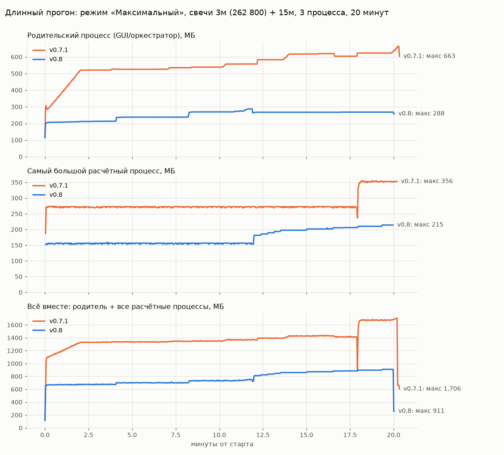

# Отчёт по этапам 0–1 (v0.8.0)

Модель бэктеста и формулы оценок **не менялись**. Тест `tests/test_core_equivalence.py` проверяет бит-в-бит совпадение с замороженной копией кода v0.7.1. Совпадают все метрики, все оценки SELECTION/VALIDATION/robust, план walk-forward, ATR, ADX, EMA и режимы Adaptive V2.

## 1. Что исправлено (по вашим требованиям)

| № | Требование | Что сделано |
|---|---|---|
| 1 | Продолжение = непрерывный прогон | Все решения поиска — функции от *множества* результатов, порядок их прихода не важен: точные top-K с полным порядком при равных оценках. После перезапуска уже посчитанная часть этапа восстанавливается из chunk-файлов. Подтверждено регрессионными тестами (раздел 2) |
| 2 | Chunk — главный источник | В конце каждого chunk есть footer со списком завершённых в нём блоков. `index.json` — только кэш, при повреждении он восстанавливается сканированием chunk-файлов. Ничего не удаляется: непроверяемые файлы уходят в `quarantine/` |
| 3 | tmp + flush + fsync + атомарная замена + резервная копия | Так пишутся все служебные файлы. Для `index.json` хранится предыдущее поколение в `.bak`; после переименования синхронизируется и каталог |
| 4 | Крестик = «Остановить» | `WM_DELETE_WINDOW` и Ctrl+C (SIGINT) идут тем же путём: остановка → запись checkpoint → окно закрывается само. Повторный крестик предлагает немедленный выход |
| 5 | Без GUI/matplotlib/pandas в workers | Запускатель `BYBIT_SUPERTREND_LAB.py` стал крошечным; workers загружают только `lab_core.py` (numpy + numba), это проверяется тестом. Свечи пишутся один раз в `market/*.npy`, initializer отображает их в память (memory-map) и переиспользует. Numba компилируется один раз в родителе (`cache=True`) |
| 6 | Один ProcessPool на прогон | Один пул на весь прогон. `max_tasks_per_child=400` оставлен только как страховка. Тест на утечки и нагрузочный тест прошли **без** этой страховки. После `BrokenProcessPool` пул пересоздаётся автоматически (процессов на 25% меньше), потерянные блоки пересчитываются |
| 7 | VALIDATION leakage | Компоненты LONG/SHORT для Adaptive V2 выбираются по полям `sel_*`, посчитанным только по SELECTION-окнам. Тест меняет все цены начиная с VALIDATION и проверяет, что области, наборы fine/cluster-кандидатов и компоненты не изменились. Если вернуть формулу v0.7.1, этот тест падает |
| 8 | Иерархический поиск | Порядок этапов: широкий грубый поиск → **поиск устойчивых областей** (точка ценна, если высок нижний квартиль оценок SELECTION у её соседей) → углубление вокруг областей → очень мелкая сетка только локально → Adaptive V2. Сетки v0.7.1 не огрублены |
| 9 | Без Optuna, объяснимость | Поиск детерминирован. Для каждого этапа в `research/<прогон>/regions/*.json` записано, какие области выбраны и почему: q25, медиана, доля положительных, число соседей. Эти файлы попадают и в ZIP-отчёт |
| 10 | Этап 2 только после проекта | Модель не трогалась |
| 11 | Parquet/DuckDB не внедрять | Не внедрено, только замеры (раздел 5) |
| 12 | Нагрузочный тест с графиками | См. раздел 3 и `tools/loadtest.py` |

Попутно исправлено:
- `START.bat`, `SELF_TEST.bat`, `DIAGNOSE.bat`: ошибка `%errorlevel%` внутри скобок. Теперь используется `if errorlevel 1`, и START.bat проверяет, что Python не старше 3.11.
- Сохранённая история обрезается до запрошенного периода.
- Осиротевшие процессы расчёта после аварии родителя завершаются сами. Раньше они висели и держали RAM.
- Журнал больше не строит текст из десятков МБ на каждое сообщение и ротируется (20 МБ × 3).
- ZIP-отчёт ограничен файлами текущего прогона.
- Защита по памяти учитывает лимит выделения памяти Windows (RAM + файл подкачки).
- Скачивание хранит свечи в numpy, а не в списках строк.
- Результаты сразу пишутся на диск, в RAM они не копятся.
- Объект результата занимает 897 байт вместо 2105.

**Важно:** результаты v0.8 сознательно отличаются от v0.7.1. Поиск устойчивых областей и устранённая утечка VALIDATION меняют, какие параметры исследуются. Незавершённые прогоны v0.7.x не продолжаются: старые папки не удаляются, но продолжить их нельзя.

## 2. Регрессионный тест: «непрерывный прогон == остановка + перезапуск + продолжение»

Сравнение точное: каждое число бит-в-бит. Сравниваются:
- итоговый TOP-100 (все поля);
- весь сохранённый пул результатов;
- выбранные устойчивые области для fine, cluster_wide и cluster_deep;
- наборы кандидатов fine-search и cluster-search (wide и deep);
- компоненты Adaptive V2;
- сохранённый пул каждого этапа.

Данные: два таймфрейма (30м, 60м), профиль «Тест».

| Сценарий | Результат |
|---|---|
| Кнопка «Стоп» в 5 разных точках (2%, 30%, 55%, 80%, 97%), продолжение с другим числом процессов | ✅ совпадает |
| Остановка каждые 7 блоков до самого конца, число процессов 1/2/3 по очереди | ✅ совпадает |
| Крестик окна в настоящем GUI Tk, затем повторный запуск GUI и «Продолжить» в диалоге | ✅ совпадает, окно закрылось < 30 с |
| Ctrl+C в настоящем GUI | ✅ совпадает |
| Ctrl+C всей группе процессов в консоли (workers тоже получают сигнал) | ✅ совпадает |
| BrokenProcessPool (worker убит SIGKILL), автоматическое восстановление пула | ✅ совпадает без перезапуска программы |
| BrokenProcessPool без права на восстановление → ошибка → продолжение | ✅ совпадает |
| Защитная остановка по памяти → продолжение | ✅ совпадает |
| Жёсткая смерть процесса: после записи chunk, но до переименования; после переименования, но до индекса; сразу после индекса; посреди незаписанного пакета | ✅ совпадает во всех 4 точках |
| Случайные SIGKILL (только родителя или родителя вместе с workers) до завершения | ✅ совпадает |
| Испорченные `index.json` и `.bak`, удалённый кэш этапов | ✅ совпадает, ни один chunk не удалён |
| Отдельный процесс + checkpoint каждые 400 проверок (много chunk-файлов) против прогона в памяти | ✅ совпадает |

Итого **44 теста пройдено** на Python 3.12. На Python 3.11 пройдено 42, ещё 2 GUI-теста пропущены (там нет tkinter). Запуск: `python -m pytest tests`.

## 3. Память: до и после

Сценарий: свечи 3м (262 800) + 15м (52 560), 3 процесса расчёта. Процессы запускаются способом spawn, как в Windows. Замер RSS каждые 2 с.

| Сценарий | Пик родителя | Пик одного worker | Пик суммарно |
|---|---|---|---|
| «Максимальный», 20 мин, v0.7.1 | 663 МБ, растёт ≈ +470 МБ/ч | 356 МБ | 1 706 МБ |
| «Максимальный», 20 мин, v0.8, **без** max_tasks_per_child | 288 МБ, плато последние 8 мин | 215 МБ | 911 МБ |
| «Глубокий», полный прогон, v0.7.1 | 329 МБ | 286 МБ | 1 105 МБ |
| «Глубокий», полный прогон, v0.8 | 259 МБ | 191 МБ | 833 МБ |
| «Глубокий», 1м-масштаб (790 000 свечей), v0.8 | 301 МБ | 296 МБ | 1 159 МБ |

Утечек нет. Лестница у workers v0.8 после 12-й минуты — это этап Adaptive V2: процесс по мере работы отображает в память общие файлы индикаторов. Отдельный замер на всех 810 задачах Adaptive V2 в одном процессе дал:
- **частная** память (RssAnon) 64,1 → 64,2 МБ, то есть не растёт;
- общая файловая память выросла на 32 МБ. Она одна на все процессы и ограничена размером файлов индикаторов.

Данные этого замера: `worker_private_vs_shared_adaptive.json`.

Скорость на одинаковой работе не изменилась: широкий этап 132 480 конфигураций занял 4,18 мин в v0.7.1 и 4,11 мин в v0.8. Ускорения я не обещаю. Остановка теперь занимает 2,5 с вместо 20 с: идущие задачи прерываются, а не дожидаются.

Дополнительный график полного прогона «Глубокий»: `loadtest_deep_full.png`. Исходные ряды лежат в `*.csv` и `*.json` в этой папке.

## 4. Безопасное число процессов

Замер: worker v0.8 ≈ 150 МБ + ≈ 195 байт на свечу самого длинного таймфрейма; в формуле взят запас 260 байт. Родителю с GUI резервируется 1,2 ГБ. Программа сама считает число процессов перед стартом: `min(логических ядер − 1, (доступная RAM − 1,2 ГБ) / память на процесс)`. Доступной RAM считается меньшее из свободной физической памяти и свободного лимита выделения памяти Windows.

Оценка при свободной RAM = объём RAM − 4 ГБ на Windows и браузер (ограничение только по памяти):

| RAM | 15м, 18 мес | 5м, 18 мес | 1м, 18 мес | 1м, 36 мес |
|---|---|---|---|---|
| 8 ГБ | 17 | 15 | 8 | 5 |
| 16 ГБ | ≥32 | ≥32 | ≥32 | 20 |
| 32 ГБ+ | ≥32 | ≥32 | ≥32 | ≥32 |

Для v0.7.1 на 16 ГБ и 1м-данных получалось около 31 процесса по 355 МБ плюс растущий родитель. Это близко к пределу и объясняет прежние BrokenProcessPool. В v0.8 на машине с 16 ГБ и больше потолок задаёт процессор, а не память. Процессов больше, чем физических ядер, почти ничего не дают.

**Для точной цифры на вашей машине:** `pip install psutil`, затем `python tools\loadtest.py --minutes 20 --spec 1:790000 --depth Глубокий`. Получите график и `worker_private_uss_peak_mb` — частную память worker, именно она расходует лимит выделения памяти Windows.

## 5. Сколько занимают результаты и что дал бы Parquet (только замер)

Замер на 71 532 реальных результатах:

| Формат | Байт на результат | Чтение всех результатов |
|---|---|---|
| текущий gzip-JSONL | 426 | 10 тыс. строк/с (7,0 с) |
| Parquet snappy | 208 | 0,32 с |
| Parquet zstd | 192 | 0,07 с (6 нужных колонок — 0,007 с) |
| numpy npz (сжатый) | 152 | — |

Проекция полного прогона по оценке сверху:
- «Глубокий»: ≈ 42 тыс. результатов на таймфрейм → ≈ 18 МБ;
- «Максимальный»: до 2,4 млн результатов на таймфрейм → ≈ 1 ГБ в JSONL против ≈ 0,45 ГБ в Parquet; на 6 таймфреймов ≈ 6 ГБ против ≈ 2,7 ГБ.

Что дал бы переход:
- места примерно в 2,2 раза меньше;
- полный повторный анализ в десятки-сотни раз быстрее;
- продолжение без кэша этапа быстрее: сейчас этап «Максимального» с ~800 тыс. результатов перечитывается ~80 с, но обычно используется кэш этапа.

Цена перехода: новая зависимость `pyarrow` (~100 МБ), и формат перестаёт читаться обычным текстовым редактором. Решение за вами.

## 6. Как проверить у себя

- `SELF_TEST.bat` — 1–2 минуты, включает «стоп → повреждённый индекс → продолжение = непрерывный прогон».
- `python -m pytest tests` — полный набор, ~3 минуты.
- `python tools\loadtest.py` — нагрузочный тест с графиком.
